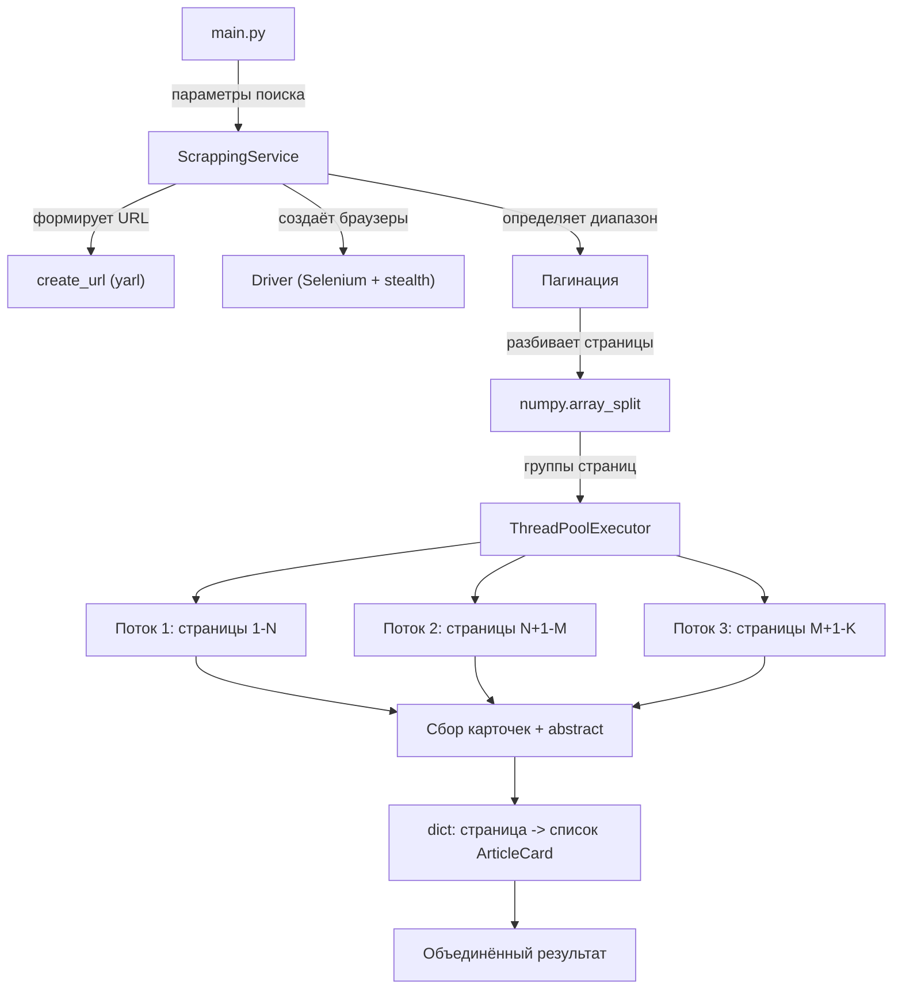

# Springer Scrapper

Многопоточный веб-скрапер научных статей с платформы [Springer Link](https://link.springer.com).
Собирает метаданные и абстракты статей по заданным параметрам поиска, используя Selenium с маскировкой автоматизации.
Содержит заготовку LLM-агента для классификации собранных статей по степени релевантности.

---

## Структура проекта

```
springer_scrapper/
├── main.py                              # Точка входа
├── docker/
│   └── docker-compose.yml               # Selenium Standalone Chrome в Docker
├── requirements/
│   ├── pyproject.toml                   # Зависимости проекта (uv)
│   ├── pyrightconfig.json               # Конфигурация Pyright
│   └── uv.lock                          # Lock-файл зависимостей
└── src/
    ├── driver.py                        # Фабрика WebDriver (Chrome + stealth)
    ├── agent/
    │   └── prompts/
    │       └── prompt.txt               # Промпт для LLM-классификации статей
    └── springer/
        ├── scrapping_service.py         # Основной сервис скрапинга
        └── utils/
            └── create_url.py            # Конструктор URL для поиска Springer
```

---

## Архитектура

### Общая схема



### Поток данных

1. **`main.py`** задаёт словарь параметров поиска (запрос, диапазон дат, сортировка, тип доступа) и создаёт экземпляр `ScrappingService`.

2. **`ScrappingService.start()`** запускает многопоточный сбор:
   - Создаёт временный WebDriver для определения общего количества страниц результатов через элементы пагинации (`[data-page]`).
   - Разбивает диапазон страниц на группы с помощью `numpy.array_split`.
   - Запускает `ThreadPoolExecutor` — каждый поток получает свою группу страниц.

3. **Каждый поток** выполняет цикл по своим страницам:
   - Открывает страницу поиска через URL, собранный `create_url` (библиотека `yarl`).
   - Плавно скроллит страницу для подгрузки динамического контента.
   - Извлекает карточки статей (CSS-селектор `.app-card-open__main`).
   - Для каждой карточки переходит на детальную страницу и собирает текст abstract (`#Abs1-content`).

4. **Результат** — словарь `dict[page, list[ArticleCard]]`, где каждая статья содержит:

| Поле | Тип | Описание |
|------|-----|----------|
| `id` | `str` | Идентификатор в формате `"{страница}.{индекс}"` |
| `title` | `str` | Заголовок статьи |
| `link` | `str` | URL статьи на Springer |
| `description` | `str` | Краткое описание со страницы поиска |
| `abstract` | `str` | Полный текст абстракта |
| `authors` | `str` | Авторы |
| `published` | `str` | Дата публикации |
| `publications_type` | `str` | Тип публикации (Article, Review и т.д.) |
| `is_access` | `bool` | Наличие полного доступа |

### Компоненты

#### `src/driver.py` — Driver

Фабрика Selenium WebDriver для Google Chrome. Применяет `selenium-stealth` для маскировки признаков автоматизации: подменяет `languages`, `vendor`, `platform`, `webgl_vendor` и `renderer`. Стратегия загрузки страниц — `eager` (не ждёт полной загрузки ресурсов).

#### `src/springer/utils/create_url.py` — PageCreateUrl

Конструктор URL для поиска Springer Link. Использует `yarl.URL` для формирования URL с query-параметрами из словаря поисковых параметров.

#### `src/springer/scrapping_service.py` — ScrappingService

Центральный сервис проекта. Реализует полный цикл скрапинга: навигация по страницам, парсинг карточек, извлечение абстрактов, многопоточная оркестрация. Ключевые методы:

- `_get_pages_range()` — определяет диапазон доступных страниц результатов
- `_collect_articles_list_from_page()` — собирает все карточки статей с одной страницы
- `_collect_abstract()` — извлекает текст abstract с детальной страницы статьи
- `_divide_pages()` — разбивает список страниц на группы для потоков
- `_scroll_slowly()` — плавный скролл для подгрузки динамического контента
- `_start_multythreads_scrapping()` — оркестрация многопоточного сбора

---

## LLM-агент (компонент в разработке)

В `src/agent/prompts/prompt.txt` находится промпт для LLM-ассистента, предназначенного для анализа и классификации собранных статей. Агент:

- Получает на вход JSON-массив статей с полями `id`, `title`, `description`, `abstract`.
- Анализирует статьи по тематике металлургии и сварки, приоритизируя поле `abstract`.
- Классифицирует статьи по уровням совпадения:
  - **high_match** (100–80%) — максимальное соответствие теме
  - **medium_match** (79–60%) — среднее соответствие
  - **low_match** (< 60%) — низкое соответствие
- Для каждой статьи предоставляет объяснение выбора и сопоставление с правилами отбора.
- Поддерживает плейсхолдеры `{target_theme}`, `{target_context}`, `{more_context}`, `{t_language}` для настройки под конкретный запрос.

---

## Технологический стек

| Технология | Назначение |
|------------|------------|
| **Python >= 3.14** | Язык проекта |
| **Selenium 4** | Автоматизация браузера, парсинг DOM |
| **selenium-stealth** | Маскировка автоматизации Chrome |
| **yarl** | Построение URL с query-параметрами |
| **numpy** | Разбиение страниц на группы для потоков |
| **uv** | Менеджер пакетов и виртуальных окружений |
| **Docker** | Контейнеризация Selenium (опционально) |
| **Pyright** | Статический анализ типов |

---

## Установка и запуск

### Предварительные требования

- Python >= 3.14
- Google Chrome (установлен локально)
- [uv](https://docs.astral.sh/uv/) — менеджер пакетов

### Установка зависимостей

```bash
cd requirements
uv sync
```

### Запуск

```bash
python main.py
```

### Docker (опционально)

Для запуска Selenium Chrome в контейнере:

```bash
cd docker
docker compose up -d
```

Контейнер поднимает Selenium Standalone Chrome на порту `4444` с ограничением в 1 сессию.
